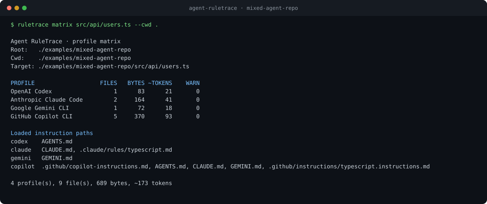

# Agent RuleTrace

**Explain exactly which instruction files a coding agent sees for a target path—and why.**

Agent RuleTrace is a local, read-only CLI for repositories that use Codex,
Claude Code, Gemini CLI, or GitHub Copilot CLI. It traces repository-wide,
nested, path-scoped, imported, user-level, shadowed, excluded, and truncated
instructions without starting an agent or sending repository data anywhere.



## Why this exists

Coding agents use similar Markdown files but discover and combine them
differently. In a monorepo, answering “what instructions apply to this file?”
can require reading four specifications, checking multiple directories,
resolving imports and globs, and remembering host-specific precedence.

Agent RuleTrace turns that work into one deterministic command:

```bash
npx agent-ruletrace explain src/api/users.ts --client claude --cwd .
```

Every decision includes the file, status, load phase, reason, byte footprint,
confidence, and the official source behind the modeled behavior.

## What it supports

| Profile | Modeled behavior |
| --- | --- |
| OpenAI Codex | User and project `AGENTS.md`, overrides, fallback filenames, root-to-CWD order, empty-file behavior, and byte-limit truncation |
| Anthropic Claude Code | `CLAUDE.md`, `CLAUDE.local.md`, lazy target ancestry, `.claude/rules`, `paths` globs, exclusions, imports, cycles, and depth limits |
| Google Gemini CLI | Global/workspace/just-in-time context, configured context filenames, imports, cycles, settings precedence, and duplicate sources |
| GitHub Copilot CLI | User, repository-wide, `applyTo`, and agent instructions; root/CWD/target discovery; content deduplication; and unspecified general order |

Profile rules are versioned with verification dates and source URLs. See
[the validation evidence](docs/VALIDATION.md) and
[technical architecture](docs/ARCHITECTURE.md).

## Installation

Requires Node.js 20 or newer.

Run without installing:

```bash
npx agent-ruletrace --help
```

Or install globally:

```bash
npm install --global agent-ruletrace
ruletrace --help
```

## Quickstart

Explain one client:

```bash
ruletrace explain src/api/users.ts --client codex --cwd .
```

Compare every built-in profile for the same file:

```bash
ruletrace matrix src/api/users.ts --cwd .
```

Produce machine-readable output:

```bash
ruletrace explain src/api/users.ts --client gemini --cwd . --format json
ruletrace matrix src/api/users.ts --cwd . --format json
```

List implemented profiles and their primary specifications:

```bash
ruletrace profiles
```

## Try the included example

The repository contains a mixed-agent fixture with root instructions, a Claude
path rule, and a Copilot `applyTo` rule:

```bash
npm install
npm run build
node dist/cli.js matrix src/api/users.ts \
  --root examples/mixed-agent-repo \
  --cwd examples/mixed-agent-repo
```

On PowerShell, the same command can be entered on one line.

The expected comparison is:

```text
PROFILE                   FILES   BYTES ~TOKENS    WARN
OpenAI Codex                  1      83      21       0
Anthropic Claude Code         2     164      41       0
Google Gemini CLI             1      72      18       0
GitHub Copilot CLI            5     370      93       0
```

## How to read a trace

- `LOADED`: included in the simulated context.
- `TRUNCATED`: included only up to the documented byte limit.
- `SHADOWED`: an applicable candidate lost to a documented selection rule or
  duplicate-content rule.
- `NO MATCH` or `EXCLUDED`: discovered but not applicable to the target.
- `PARSE ERROR`, `CYCLE`, `DEPTH`, `LIMIT`, or `BLOCKED`: tracing continued,
  but the result contains a warning.

Sequence numbers appear only when the client guarantees order. Profiles such as
Copilot CLI deliberately omit sequence numbers where the specification does not
guarantee a general precedence.

Exit codes are stable:

| Code | Meaning |
| --- | --- |
| `0` | Complete trace, including a valid trace with no instruction files |
| `1` | Trace produced with warnings or indeterminate inputs |
| `2` | Invalid invocation, missing target, unknown profile, or inconsistent paths |
| `3` | Unexpected internal failure |

## Configuration

Common options:

```text
--root <path>          Project boundary; defaults to the nearest Git root
--cwd <path>           Simulated client launch directory
--format text|json     Human-readable or stable structured output
--include-user         Opt in to user-level instruction files
```

For safe, reproducible user-scope traces, provide an explicit home:

```bash
ruletrace explain src/index.ts --client claude --include-user \
  --claude-home /path/to/.claude
```

Client-specific `explain` options include:

- Codex: `--fallback <filename>` (repeatable), `--max-bytes <bytes>`,
  `--codex-home <path>`.
- Claude Code: `--exclude <glob>` (repeatable), `--claude-home <path>`.
- Gemini CLI: `--context-file <filename>` (repeatable),
  `--gemini-home <path>`.
- Copilot CLI: `--copilot-home <path>`.

Run `ruletrace explain --help` or `ruletrace matrix --help` for the complete
contract.

## Data, privacy, and security

- Runtime operation is local and makes no network requests.
- The CLI reads files but never edits them or executes repository code.
- User/home instructions are excluded unless `--include-user` is present.
- Home paths are redacted as `<home>` in decisions.
- Directory symlinks are not followed during discovery.
- File symlinks and imports that escape the declared boundary are reported and
  not read.
- YAML is parsed as data; custom tags are rejected.
- No telemetry, accounts, API keys, or cloud service are used.

The package E2E test installs the generated npm tarball into a clean temporary
project and runs all commands while Node networking APIs are blocked.

## Architecture

```text
CLI input
  → canonical root / CWD / target boundary
  → source-linked client profile
  → safe discovery, parsing, matching, and provenance decisions
  → normalized trace
  → text, JSON, or four-profile matrix
```

The JSON schema is versioned independently through `schemaVersion`. Full design,
failure behavior, test strategy, and release gates are documented in
[docs/ARCHITECTURE.md](docs/ARCHITECTURE.md).

## Known limitations

- This is a simulator of documented on-disk behavior, not a wrapper around
  private agent internals.
- Organization instructions and host-provided context that are unavailable on
  disk cannot be reconstructed.
- The Copilot profile targets GitHub Copilot CLI; editor and GitHub.com hosts
  differ.
- Token counts are an explicit byte-based approximation, not provider-specific
  tokenizer results.
- Profile behavior can change upstream; each profile exposes its source URLs and
  last verification date.
- Windows, macOS, and Linux are targeted; the first public CI matrix will verify
  Node 20 and the current LTS across all three.

## Development

```bash
npm install
npm run check
npm run demo
```

`npm run check` performs strict TypeScript validation, the unit/profile suite,
the production build, a real tarball clean-install, offline CLI runs, package
content assertions, and exit-code checks.

Contributions should include a focused test and a primary source for any
profile-behavior change. Please avoid inferring undocumented precedence.

## Roadmap

- Ship `v0.1.0` with four source-linked profiles and cross-platform CI.
- Add schema fixtures for downstream integrations.
- Consider more clients only when their behavior can be validated from primary
  sources.

## License

[MIT](LICENSE)
